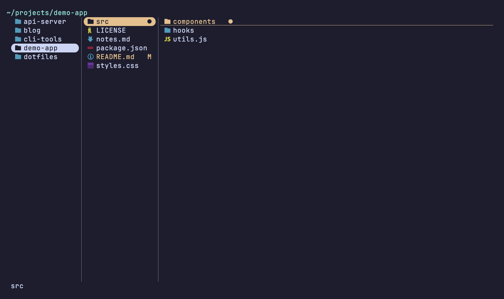
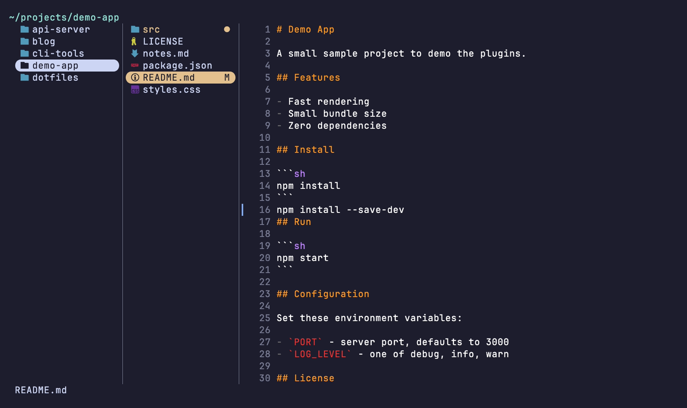
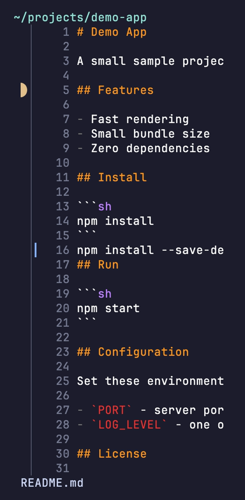

# yazi-plugins

A small collection of [yazi](https://yazi-rs.github.io/) plugins.

Built and tested against yazi 26.5.6. Yazi's plugin API changes between
releases; expect small fixes needed on other versions.

## Plugins

| Plugin | What it does |
| --- | --- |
| [vscode-git-colors](vscode-git-colors.yazi/) | VS Code style git status colors and marks on file names, in every column. |
| [vscode-git-gutter](vscode-git-gutter.yazi/) | VS Code style git change gutter in the text preview, with instant scrolling. |
| [mobile-auto-layout](mobile-auto-layout.yazi/) | Column widths that adapt to content, screen size, and reading, built for phone terminals. |

## Screenshots

Git status colors and badges in the file list ([vscode-git-colors](vscode-git-colors.yazi/)):



Change gutter in the text preview ([vscode-git-gutter](vscode-git-gutter.yazi/)):



Phone width two-panel layout ([mobile-auto-layout](mobile-auto-layout.yazi/)):



## Install

```sh
ya pkg add ShikherVerma/yazi-plugins:vscode-git-colors
ya pkg add ShikherVerma/yazi-plugins:vscode-git-gutter
ya pkg add ShikherVerma/yazi-plugins:mobile-auto-layout
```

Each plugin's README covers setup and options.

## License

MIT. See [LICENSE](LICENSE).
